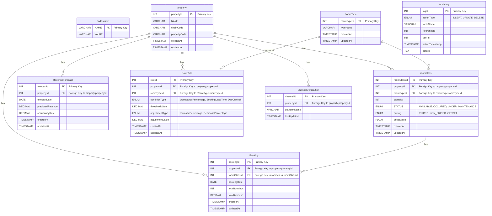

#inngrid-rms

> [!info]- Project 101
> >[!tip]- Image of the Project
> >![[DrawIO InnGRiD RMS.png|750]]
> 
> >[!success]- Overview of Model
> >Let's start top to bottom...
> >We have property table and room type table in our backend. We assume the PMS operates at Room Type Level (addressing it's inventory as Suite, Standard, Deluxe, etc.)
> >In the backend, everything is operated at Room Class Level
> >RC Id is auto-incremented PK of RC Table and  <span style="color:rgb(102, 207, 255)">Room Class Id → (Property Id, Room Type Id)</span>
> > The PMS sends it's data to FDS. FDS microservice will accept data from PMS at a specific time (using a cron job). The population of BDE data takes place at Property and Room Type Level. 
> > The FDS then hits the Casper to fetch respective RC Id and send the BDE data at RC level and populates the PMS Inv Type Table
> > This data is referred by Forecasting Model in IP Microservice to make predictions at RC level and then decisions are populated in Revenue Forecast Table at RC Level in Casper
> > These decisions are then pushed to INTF. The INTF converts the RC Level data to (Property, RT Level) and sends back to PMS
> 
> 
> > [!help]- Microservice Overview
> >4 Microservices are to be created: Casper (Backend), FDS (sending BDE Data), IP(Forecasting Models), INTF(to push decisions)
> > +PMS system can also be created which can become it's own microservice
> > +Haven't started working on Rate Shopping (as of yet) but that data should also go in a separate microservice

#### To Do


### Work Done
- Finished with the property controller ✅
- Done with RC and RT Controllers ✅
- Added POST call to send BDE Data in .csv file ✅
- Added CI/CD Pipeline for Project ✅
	- currently, it runs for each push, need to update it for only PRs
- Add a cron job ✅
	- done with cron job scheduling
- Run a simple python file from spring boot ✅
	- then make try to integrate it with cron job ✅🎯
- ARIMA Model for forecasting ✅🎯
	- Done with this - the model uses 90 days of  past data, makes decision on forecasted revenue and adds it to `RevenueForecast` table + cron job is added
- Add PSP for 90 days of past data
- Fix the schema of table yet again...

#### FDS Microservice
![[InnGRiD RMS - FDS Overview.png|750]]
To Do in FDS (21/02, Friday):
- Get BDE data from PMS - Cron Jobs
- Store data at RC Level
- Push data into Casper

**Future Work**
- Adding auditing - use audit table
- Add caching 
- Include Rate shopping into model
### Database Schema





```MySQL
DROP DATABASE rms;

CREATE DATABASE rms;

DROP TABLE IF EXISTS AuditLog;
DROP TABLE IF EXISTS ChannelDistribution;
DROP TABLE IF EXISTS RateRule;
DROP TABLE IF EXISTS RevenueForecast;
DROP TABLE IF EXISTS Booking;
DROP TABLE IF EXISTS roomclass;
DROP TABLE IF EXISTS RoomType;
DROP TABLE IF EXISTS property;
DROP TABLE IF EXISTS codeswitch;

CREATE TABLE IF NOT EXISTS codeswitch(
NAME VARCHAR(255) NOT NULL,
VALUE VARCHAR(255) NOT NULL,
PRIMARY KEY(NAME)
);

CREATE TABLE IF NOT EXISTS property (
    propertyId INT AUTO_INCREMENT PRIMARY KEY,
    NAME VARCHAR(255) NOT NULL,
    chainCode VARCHAR(50) NOT NULL,
    propertyCode VARCHAR(50) NOT NULL,
    createdAt TIMESTAMP DEFAULT CURRENT_TIMESTAMP,
    updatedAt TIMESTAMP DEFAULT CURRENT_TIMESTAMP ON UPDATE CURRENT_TIMESTAMP
);

-- store one time data about Standard, Suite, etc Roomtype data
CREATE TABLE  IF NOT EXISTS RoomType (
    roomTypeId INT AUTO_INCREMENT PRIMARY KEY,
    typeName VARCHAR(100) NOT NULL,
    createdAt TIMESTAMP DEFAULT CURRENT_TIMESTAMP,
    updatedAt TIMESTAMP DEFAULT CURRENT_TIMESTAMP ON UPDATE CURRENT_TIMESTAMP
);

-- room class table
CREATE TABLE IF NOT EXISTS roomclass (
    roomClassId INT AUTO_INCREMENT PRIMARY KEY,
    propertyId INT NOT NULL,
    roomTypeId INT NOT NULL,
    capacity INT NOT NULL,
    STATUS ENUM('AVAILABLE', 'OCCUPIED', 'UNDER_MAINTENANCE') NOT NULL,
    pricing ENUM('PRICED', 'NON_PRICED', 'OFFSET') NOT NULL,
    offsetValue FLOAT DEFAULT NULL,
    createdAt TIMESTAMP DEFAULT CURRENT_TIMESTAMP,
    updatedAt TIMESTAMP DEFAULT CURRENT_TIMESTAMP ON UPDATE CURRENT_TIMESTAMP,
    UNIQUE KEY(propertyId, roomTypeId)
);

-- store BDE data
CREATE TABLE IF NOT EXISTS Booking (
    bookingId INT AUTO_INCREMENT PRIMARY KEY,
    propertyId INT NOT NULL,
    roomClassId INT NOT NULL,
    bookingDate DATE NOT NULL,
    totalBookings INT NOT NULL,
    totalRevenue DECIMAL(10, 2) NOT NULL,
    createdAt TIMESTAMP DEFAULT CURRENT_TIMESTAMP,
    updatedAt TIMESTAMP DEFAULT CURRENT_TIMESTAMP ON UPDATE CURRENT_TIMESTAMP
);

-- table that will store decisions
CREATE TABLE RevenueForecast (
    forecastId INT AUTO_INCREMENT PRIMARY KEY,
    propertyId INT NOT NULL,
    forecastDate DATE NOT NULL,
    predictedRevenue DECIMAL(10, 2) NOT NULL,
    occupancyRate DECIMAL(5, 2) NOT NULL,
    createdAt TIMESTAMP DEFAULT CURRENT_TIMESTAMP,
    updatedAt TIMESTAMP DEFAULT CURRENT_TIMESTAMP ON UPDATE CURRENT_TIMESTAMP,
);

-- config table: IP for BAR decisions
CREATE TABLE IF NOT EXISTS RateRule (
    ruleId INT AUTO_INCREMENT PRIMARY KEY,
    propertyId INT NOT NULL,
    roomTypeId INT NOT NULL,
    conditionType ENUM('OccupancyPercentage', 'BookingLeadTime', 'DayOfWeek') NOT NULL,
    thresholdValue DECIMAL(10, 2) NOT NULL,
    adjustmentType ENUM('IncreasePercentage', 'DecreasePercentage') NOT NULL,
    adjustmentValue DECIMAL(5, 2) NOT NULL,
    createdAt TIMESTAMP DEFAULT CURRENT_TIMESTAMP,
    updatedAt TIMESTAMP DEFAULT CURRENT_TIMESTAMP ON UPDATE CURRENT_TIMESTAMP
);

-- rate shopping channels tables
CREATE TABLE IF NOT EXISTS ChannelDistribution (
    channelId INT AUTO_INCREMENT PRIMARY KEY,
    propertyId INT NOT NULL,
    platformName VARCHAR(100) NOT NULL,
    lastUpdated TIMESTAMP DEFAULT CURRENT_TIMESTAMP
);

-- audit table
CREATE TABLE IF NOT EXISTS AuditLog (
    logId INT AUTO_INCREMENT PRIMARY KEY,
    actionType ENUM('INSERT', 'UPDATE', 'DELETE') NOT NULL,
    tableName VARCHAR(100) NOT NULL,
    referenceId INT NOT NULL,
    userId INT NOT NULL, -- Assuming a User table exists
    actionTimestamp TIMESTAMP DEFAULT CURRENT_TIMESTAMP,
    details TEXT
);

```
