#placement-preparation #dbms

**What is data?**
Data refers to facts, figures, or statistics that are collected and used for reference or analysis. It could be anything from numbers, text, images, audio, or video.

**What is a Database?**  
A database is an organized collection of data that is stored typically in a structured format. It allows for efficient storage, retrieval, and manipulation of data.

**What is a DBMS?**
A DBMS is a collections of programs/software system that interacts with users, applications and allows me (the developer) to create and maintain a database. It allows to store the data, maintain it in systematic order, retrieve and update the data whenever needed

**Difference between file system and DBMS?**
![[Pasted image 20241221105526.png|600]]

**Advantages of DBMS over File System?**
1. Data redundancy - We can <mark style="background: #BBFABBA6;">avoid duplicate data</mark> in DBMS
2. Data constraints - We can <mark style="background: #BBFABBA6;">enforce constrains</mark> in DBMS
3. Data access - DBMS supports <mark style="background: #BBFABBA6;">query language for faster retrieval</mark> of data
4. Data concurrency - Multiple users can access and manipulate data in DBMS

---
#### ACID Properties in DBMS
ACID properties ensure the consistency of data within the database

1. `Atomicity`: The transaction is atomic - treated as a single, indivisible unit. Either all the operations within the transaction are performed, or none of them are. `--abort, --commit
	*If A is sending 200 to B then deduct 200 from A's account and add 200 to B's. Both are necessary*
2. `Consistency`: The database must be consistent before and after transaction
	*After sending money from A to B, the total A+B must be same before and after*
3. `Isolation`: Different transactions are isolated from one another and intermediate state of one transaction is not visible to other concurrent transactions.
	*If two users are simultaneously booking the last seat on a flight, isolation ensures that only one transaction succeeds, avoiding conflicts.*
4. `Durability`: Once the transaction is committed, it is durable and will not revert in case of a failure
#### Abstraction levels in DBMS
> Developers hide the complexity of DBMS to simplify user's interaction with the system

1. `Physical Layer`: lowest level defines <span style="color:rgb(57, 255, 20)">how data is actually stored in disk,</span> or in B-Tree or hash tables, etc.
2. `Logical Layer`: middle level defines the <span style="color:rgb(57, 255, 20)">relationship between the data</span> - foreign keys/attributes
3. `View Layer`: highest level defines the view to <span style="color:rgb(57, 255, 20)">actual view/presentation of data</span> to users

---
#### Data modelling
It is the visual representation of data and the relationship that exists between different data points. It is critical in database design and serves as a blueprint

There are 2 levels to it - `high level` (defines the relationship between data) & `low level` (defines the relationship between storage of data)

#### ER Model
Entity Relationship model is a high level data model and uses - `Entity, Attributes and Relationships` to define the database
![[Pasted image 20241221120426.png|450]]
**Entity**:
- Represents an object or concept that has data stored about it in the database.
- Types: 
	- `Strong entity` - can exists on its own - (e.g., "Customer")
	- `Weak entity` - depends on strong entity to exist - (e.g., "Order Item")

**Attribute**:
- Describe a property of an entity
- Types:
	- `Key attribute`: represents the main characteristic (indistinguishable feature) (represented with an underline in the diagram)
	- `Simple attribute:` attribute that can't divided further (e.g., first name)
	- `Composite attribute`: attribute that can be divided further (e.g., full name - first name + last name)
	- `Derived attribute`: attribute that can be divided further (e.g., age can be derived from dob)
	- `Multivalued attribute`: attribute that can take multiple value (e.g., phone number)

**Relationship**:
- Defines formation of an association between two entities
- Types: 
	- Strong and Weak: Strong association/Weak association
	- `1:1` : Person -> Aadhar
	- `1:Many`: Person -> Multiple phone no./email
	- `Many:1`: Many students -> 1 college
	- `Many:Many`: Many students -> many branches
![[Pasted image 20241221123411.png|300]]

**Key**:
Special attribute or set of attribute that can identify a data point in the table
- `Primary key`: set of attribute that can uniquely identify a record in the table
	*E.g., if name alone is not unique to identify, the combination of name-mobile can be used to identify a person*
- `Candidate key`: set of attributes that can uniquely identify a record. A table may have multiple candidate keys, but only one is chosen as the primary key
	*E.g., the combination of name-email could also have been a candidate for primary key*
- `Foreign key`: attribute in one table that references the primary key of another table, establishing a relationship between the two tables.
	*E.g., propertyInvTypeId, upsPropertyId, propertyId, roomClassId are used in many tables🗣️*
- `Composite key`: A combination of two or more attributes used to uniquely identify a record.
	*E.g., In propertycontinuouspricing table, propertyid, seasonId, ipdow, roomclassid are required to identify 1 entry (FnC OccDate level override API - when date is not SE)*

#### EER Model
Extended ER is an enhancement of the ER diagram, designed to represent more complex data requirements in real-world systems.

- `Inheritance`: sub-entities inherit attributes and relationships of their parent entity 
	*Student is a person, and has an additional studentId attribute*
- `Specialization`: an entity is divided into sub-entities based on certain distinguishing characteristics
- `Generalization`: two or more entities with common features are combined into a single, generalized entity.
- `Aggregation`: combining a entity-relationship into a single entity
---
#### Functional Dependency
Sometimes <mark style="background: #ABF7F7A6;">an attribute can uniquely identify another attribute</mark> (like upsPropertyId -> propertyId).
In other words, if you know the value of a set of attributes on the left-hand side (LHS) of the dependency, you can uniquely determine the value of the attributes on the right-hand side (RHS).

> [!faq] Definition
> Functional Dependency is a constraint that determines this dependency/relation of one attribute on another
> *(determinant)* **upsPropertyId→propertyId** *(dependent)*

```mermaid
flowchart TD 
    A[Functional Dependencies] --> B[Multivalued FD]
    A --> C[Trivial FD]
    A --> D[Non-Trivial FD]
    A --> E[Transitive FD]

    B --> B1[Example: A → B, A → C]
    C --> C1[Example: B ⊆ A, A → B]
    D --> D1[Example: B ⊄ A, A → B]
    E --> E1[Example: A → B, B → C, A → C]
```




**Multi-valued FD:**
One attribute determines multiple independent attributes
E.g., `manufacture-year` and `model-name` maybe independent attributes for a `car` entity but a `car-model-no ` can determine both independent attributes

**Trivial FD:**
When determinant is a set of attributes that contains the dependent
E.g., {`employee-id`, `employee-name`} -> `employee-id` is a trivial functional dependency as `employee-id` is a subset of {`employee-id`,`employee-name`}.
for example, the first 2 digits in GST number indicates state, so GST-NO -> STATE because state is already part of GST No.

**Non-trivial FD:**
When the determinant is a set of attributes that does not contains the dependent
E.g., {`employee-id`, `employee-name`} -> `employee-salary` is a non-trivial functional dependency as `employee-salary` is not in subset of {`employee-id`,`employee-name`}.

**Transitive FD:**
When one attribute depends on another indirectly, through a third attribute.
E.g., `upsPropertyId` -> `rate-shopping-id` -> `rate-shopper-competitors`

#### Armstrong's Axioms/Inference Rules
Armstrong's Axioms are a set of inference rules used in functional dependency theory to derive all the functional dependencies that hold in a relation. 

- `Reflexivity`Reflexivity If B⊆A, then A→B
- `Augmentation`: If A→B, then AC→BC
- `Composition`: If A→B and C→D, then AC→BD

- `Transitivity`: If A→B and B→C, then A→C
- `Pseudo-transitive`: If A→B and BC→D, then AC→D

- `Union`: If A→B and A→C, then A→BC
- `Decomposition`: If A→BC, then A→B and A→C

#### Functional Dependency Closure
Closure (which means complete set) of functional dependencies that can be derived from a given set of FDs using Armstrong's Axioms.

> [!faq] Definition
> So, if you are given 2 functional dependencies A = {X→Y and Y→Z} , what are all the FDs that you can derive from these is represent by A\*
> If A* is a FDC, then it always contains atleast 1 attribute - A itself

#### Minimal Cover
The minimal cover (or canonical cover) of a set of FDs is a simplified, equivalent set of FDs that preserves the original dependencies but eliminates redundancy. 

>[!faq] Definition
   Each FD has a single attribute on the right-hand side in minimal cover
> X→YZ is split into X→Y and X→Z.

#### Decomposition Properties
Decomposition is breaking down of a table into multiple tables to eliminate anomalies, redundancies, inconsistencies
Properties:
- `Losless decomposition`: no info is lost
- `Dependency preserving`: no dependency is lost
- `Attribute preserving`: no attribute is lost
- `Non-additive join`: rejoining them back leads to the same state (nothing lost/nothing added)

---
#### Normalization
Process of organizing data in a database to minimize redundancy and dependency.

> [!imp]
> Types of normal forms:
>1. `1NF`: Every single attribute is simple attribute i.e., atomic value
*If a table with a column that contains multiple phone numbers must be split so that each phone number has its own row.*
>1. `2NF`: 1NF + all non-prime attributes (attributes that are not part of candidate key) are only dependent on primary key; not even candidate key
*If a table has (student-id, course-id) as a candidate key, and "student-name" depends only on student-id, it violates 2NF.*
>1. `3NF`: 2NF + no transitive dependency between non-prime attributes (a non-key column should not be dependent on another non-key)
>2. `Boyce-Codd NF`: 3NF + every determinant is a candidate key. (stricter version of 3NF that handles edge-cases)
*If teacher-id→subject but subject→teacher-id is also true, then BCNF ensures redundancy is removed by restructuring.*
>5. `4NF`: BCNF + no multi-valued dependencies
*1 student enrolled in multiple courses is violation of 4NF*

> 1NF: all column values are atomic and have only 1 values, can't have 2 or more values
> 2NF: PK is able to determine all non-prime attributes
> 3NF: Non-prime attribute can't determine another non-prime attribute
> BCNF: Candidate Key is able to determine all non-prime attribute
> 4NF: No one-to-many relation
> 5NF: Decompose table to smaller table so that it can't be split further
> <span style="color:rgb(255, 49, 49)">Note</span>: In 2NF, non-key attributes depend only on PK but in BCNF, non-key attributes depend on candidate key


---
#### Query Processing and Execution
![[Pasted image 20241223194746.png|450]]
Query processing is translation of high-level queries into low-level queries
It involves 2 steps:
- Parsing:
	- Query undergoes lexical, syntactic and semantic analysis
	- In lexical analysis, the query is broken down into tokens, whitespaces and comments are removed
	- In syntactic analysis, the syntax of the query is checked
	- In sematic analysis, the meaning of the query is checked
- Translation:
	- Translates the query into relation algebra query

---
#### Transactions in DBMS
A transaction can be a set of SQL queries that are defined as 1 unit of work and are indivisible. For e.g., sending money from A's account to B's account - which contains 2 operations of deducting money from A and incrementing money for B

Either all the operations should be successful or none and hence, transactions ensure data consistency and integrity by following the  [[#ACID Properties in DBMS]]

Example:
```MySQL
START TRANSACTION;
UPDATE accounts SET balance = balance - 100 WHERE account_id = 'Alice';
UPDATE accounts SET balance = balance + 100 WHERE account_id = 'Bob';
COMMIT;
```

#### State Diagram 
It represents the different stages a transaction goes through during its lifecycle, from initiation to termination. 


---
#### DBMS Scheduling

> Let's take transaction up-a-notch. What happens when there are multiple transactions running?

Refers to the process of managing and organizing execution of transaction and follow ACID Properties when multiple transaction are running

The **scheduler** controls the sequence in which these transactions are executed, ensuring they don’t interfere with each other in a way that could cause data inconsistencies.

**Conflicts in Scheduling**:
- `Read-Write` : One transaction reads, while other is writing
- `Write-Write`: Two transactions are trying to write at the same time

**Serial Schedules**:
- transactions are executed one after the other, without overlapping, such that no two transactions are executed at the same time.
**Non-serial schedules**:
-  transactions are executed concurrently, with interleaved operations
- requires careful management to avoid conflicts


> [!faq]
> **Confusion** - all are same ??
> *Strict*: once a transaction has written (modified) a value, no other transaction can read or write that value until the first transaction is completed
> *Cascadeless*: if a transaction reads a data item written by another transaction, that other transaction must be committed before the reading transaction can read it
> *Recoverable*: if a transaction reads a value written by another transaction, the reading transaction can only be committed if the writing transaction is also committed.

> [!important] I hope this clears the confusion about cascadeless !!  But I am still confused about the rest...
> Let's understand Cascadeless by first understanding cascade scheduling
> ![[Cascading Schedule.png|350]]
> Here as you can see there are 3 Transactions, T1 performs reads, and then writes something (it has not committed yet)
> Now this value written by T1 is read by T2 and then it performs write (T2 has also not committed) and then T3 does the same - reads what T2 has written and then performs write
> Now if T1 aborts the transaction, then T2 will also have to abort because it wrote something based on something it read which has now be undo-ed; same goes for T3 and now all have to abort
> So all in all, in cascadeless, a transaction read values only after all transactions whose changes they are going to read, have commited

> Note from GFG:
> Note – It can be seen that:
> Cascadeless schedules are stricter than recoverable schedules or are a subset of recoverable schedules.
> Strict schedules are stricter than cascadeless schedules or are a subset of cascadeless schedules.
> Serial schedules satisfy constraints of all recoverable, cascadeless and strict schedules and hence is a subset of strict schedules.
> The relation between various types of schedules can be depicted as:
> ![[Pasted image 20250213105927.png|450]]
#### Serializability

When multiple transactions **run concurrently**, serializability ensures that they don't leave db in an inconsistent state

Serial schedules → Serialized
Non-serial schedules → Not always serialized


A schedule is conflict serializable if it can converted into serial schedule after **swapping non-conflict** operations

**Conflicting operations**
The operations are called conflicting operations, if all the following three conditions are satisfied:
- Both the operation belongs to separate transactions.
- Both works on the same data item.
- At least one of them contains one write operation.
---
#### Concurrency Protocols
Concurrency is the ability of multiple database operations to occur at the same time
To employ concurrency and maintain the state of the database, DBMS implements concurrency protocols

1. Lock based protocols
	- *Locks* controls the access to an item, for any operation to read/write that item it must acquire that lock
	- Types of Locks:
		- Shared Locks: allow multiple operations to acquire; are read-only locks, so those who have acquired can only read, not write
		- Exclusive Locks: allow only 1 operation to acquire, the one that has acquired can perform both read or write 
	- **2 phase locking protocol**:
		- ![[Pasted image 20241224114453.png|350]]
		- Any transaction must acquire all required locks before performing any operations, this is done in the *growing phase*. In this phase, the transaction can only acquire locks, not release them or cannot perform any operation
		- The next phase is *locked phase*, where the all operations must be performed. Here it cannot acquire/release locks
		- The final phase is *shrinking phase*, where all the locks are released
	- **Strict 2 phase locking**:
	- 


---
#### MySQL 
![[MySQL Cheat Sheet.pdf]]0
##### SQL Commands


##### Stored Procedures
```MySQL
DELIMITER //
CREATE PROCEDURE procedure_name ([IN | OUT | INOUT] parameter_name datatype, ...)
BEGIN
    -- Procedure body (SQL statements)
END //
DELIMITER ;
```

##### Triggers
```MySQL
CREATE TRIGGER trigger_name
{BEFORE | AFTER} {INSERT | UPDATE | DELETE}
ON table_name
FOR EACH ROW
BEGIN
    -- Trigger body (SQL statements)
END;
```

##### View
```MySQL
CREATE VIEW view_name AS
SELECT column1, column2, ...
FROM table_name
WHERE condition;
```

##### Function
```MySQL
DELIMITER //
CREATE FUNCTION function_name (parameter_name datatype, ...)
RETURNS datatype
DETERMINISTIC   
BEGIN
    -- Function body (SQL statements)
    RETURN value;
END //
DELIMITER ;

# Use `DETERMINISTIC` if the function always produces the same output for the same inputs, otherwise use `NOT DETERMINISTIC`
```

##### Event
```MySQL
CREATE EVENT event_name
ON SCHEDULE {AT timestamp | EVERY interval}
DO
ON COMPLETION PRESERVE
BEGIN
    -- Event body (SQL statements)
END;
```

---
