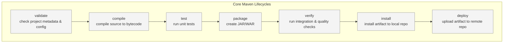

#placement-preparation #maven

Apache Maven is a build automation and project management tool
It’s used to compile, package, test, and deploy applications in a standardized and automated way

> [!summary] Important Terminologies
>  - POM (Project Object Model)
> 	 - Central configuration file: `pom.xml`
> 	 - Contains metadata (groupId, artifactId, version), dependencies, and plugin configurations
>  - Repositories
> 	 - *Local Repository*: Cache on your machine (usually `~/.m2/repository`)
> 	 - *Central Repository*: Default remote source for libraries
> 	 - *Remote Repository*: Organization-specific custom repository

---
#### What Maven does
1. **Build Automation**
- Handles compiling source code, running tests, packaging (JAR/WAR), and deployment automatically.
- Replaces manual build scripts (like Ant’s lengthy XML build files).

2. **Dependency Management**
- Automatically downloads required libraries (JARs) from a remote repository (like Maven Central).
- Resolves transitive dependencies — libraries required by your dependencies.

3. **Project Management**
- Uses a POM file (pom.xml) to describe project structure, dependencies, plugins, and goals.
- Supports multi-module projects, maintaining consistent build configurations.

4. **Lifecycle Management**
- Defines a standard build lifecycle: (below are the phases (and the goals of each phase) of the maven lifecycle)



> [!faq] 
> If you want to run `install` phase, then all the previous phases are executed  

---
### pom.xml
`pom.xml`defines:
1. Project metadata (like name, version, and description)
2. Dependencies your project needs
3. Plugins used in the build process
4. Build lifecycle configurations
5. Repositories, profiles, and more
#### Important Sections
**GAV**
```xml
<groupId>com.example</groupId>
<artifactId>my-app</artifactId>
<version>1.0.0</version>
```
- groupId → Uniquely identifies the organization or project (like a Java package name)
- artifactId → The name of the project (used as the JAR/WAR name)
- version → Defines which version of the artifact is being built
📍Together they form the GAV (Group, Artifact, Version) coordinates

**Packaging**
```xml
<packaging>jar</packaging>
```
- Defines the project output type — `jar, war, pom, ear` (default is `jar`)

**Name and Description**
```xml
<name>My Application</name>
<description>Sample Maven Project</description>
```
- Optional metadata for display and documentation

**Parent**
```xml
<parent>
    <groupId>org.springframework.boot</groupId>
    <artifactId>spring-boot-starter-parent</artifactId>
    <version>3.4.1</version>
</parent>
```
- Each `pom.xml` will always have a `parent pom.xml` file. This `parent pom.xml` can be uniquely identified by GAV and hence, the GAV details are added inside the `<parent>` 

> [!tip] 
>  If your `pom.xml` does not have a `<parent>`; then maven automatically adds a parent which is called as `Super pom`
>  Effective POM = Super POM + Parent POM (optional) + Your POM
>  
>  Or simply think of it as the Object Class of Java

**Properties**
```xml
<properties>
    <java.version>21</java.version>
    <maven.compiler.source>${java.version}</maven.compiler.source>
    <maven.compiler.target>${java.version}</maven.compiler.target>
</properties>
```
- `<properties>` holds the reusable variables

**Dependencies**
```xml
<dependencies>
    <dependency>
        <groupId>org.springframework.boot</groupId>
        <artifactId>spring-boot-starter-web</artifactId>
    </dependency>
</dependencies>
```
- Lists all libraries the project requires. Each dependency can specify:
	- *scope*:  `compile, test, provided, runtime`
	- *version*
	- *optional or exclusions*

**Dependency Management**
```xml
<dependencyManagement>
    <dependencies>
        <dependency>
            <groupId>com.example</groupId>
            <artifactId>common-lib</artifactId>
            <version>1.2.3</version>
        </dependency>
    </dependencies>
</dependencyManagement>
```
- Used only in parent POMs — child modules inherit versions without redefining them
- So the child POM will:
```xml
  <dependencies>
    <dependency>
	    <groupId>com.example</groupId>
		<artifactId>common-lib</artifactId>
      <!-- no version needed! -->
    </dependency>
  </dependencies>
```

**Build**
```xml
<build>
    <plugins>
        <plugin>
            <groupId>org.apache.maven.plugins</groupId>
            <artifactId>maven-compiler-plugin</artifactId>
            <version>3.10.1</version>
        </plugin>
    </plugins>
</build>
```
- Customizes the build process:
	- Specifies plugins (like compiler, surefire, shade, etc.)
	- Defines source directories and output folders
	- Configures plugin executions

**Repositories**
```xml
<repositories>
    <repository>
        <id>central</id>
        <url>https://repo.maven.apache.org/maven2</url>
    </repository>
</repositories>
```
- Defines remote repositories to search for dependencies beyond Maven Central

**Profile**
```xml
<profiles>
    <profile>
        <id>dev</id>
        <activation>
            <activeByDefault>true</activeByDefault>
        </activation>
        <properties>
            <env>development</env>
        </properties>
    </profile>
</profiles>
```
- Used for environment-specific configurations (like dev, test, prod)

