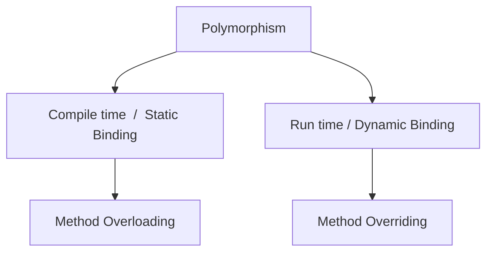

#oop #placement-preparation #spring-boot 

**What is a class and what is an object?**
Class is a template/blueprint for an object, whereas an object is an instance of the class
You can wrap multiple variables/methods in the template so that each object will have its own instance and define the behavior

**Object Oriented Programming**
OOP is a programming concept that relies on the ideas of classes and object to structure a program into simple, reusable piece of code
#### Difference between OOP and POP

| **Object Oriented Programming**      | **Procedural Oriented Programming**       |
| -------------------------------- | ------------------------------------- |
| Program is divided small objects | Program is divided in small functions |
| Has access modifier(s)           | No access modifier(s)                 |
| Provides data hiding             | No data hiding                        |
| Overloading is possible          | Overloading is not possible           |
| E.g., C++, Java                  | E.g., C, Pascal                       |

---
## Basics of OOP
#### Different Ways to create objects
1. Using the new operator:
	- the "new" operator if followed by a call to constructor to create an object
	- memory is allocated during run-time, if memory allocation is not possible, it throws run-time exception
2. Using class.newInstance():
	- newInstance is the method of Class "class"
	- Car.class.newInstance() will return an object of class "Car"
3. Using class.getConstructor().newInstance():
	- newInstance() is also the method of Class "Constructor"
	- The class.newInstance() above internally uses this to create an object
4. Using clone():
	- If obj1 is an existing object of class "Car", then (Car) obj1.clone() will return a clone of the object

---
#### Constructors
- are used to create an object
- does not have a return type
- have the same name as class
- a default constructor is provided by the compiler itself
- 3 types - default, parameterized, non-parameterized

**Private Constructors**:
- a constructor if declared private, limits the creation of an object within the class, so you cannot create the object from outside the class; although you can call this from inside a method
- They are used in utility classes to prevent object creation - `Math, Collections`
- They are also used in Singleton constructors...

**Singleton Constructor**:
limits the number of instances of a class to 1
```Java
public class Singleton {
    private static Singleton instance; // Single instance of the class

    private Singleton() {    //use of private constructor
        // Private constructor
    }

    public static Singleton getInstance() {
        if (instance == null) {
            instance = new Singleton(); // Lazy initialization
        }
        return instance;
    }
}
```

---
#### Instance Variables
- Variables declared inside a class are instance variables. For each instantiation of a class (object), a separate set/copy of variables is created and defined
- Instance variables are accessible by all non-static methods in the class
- Instance variables are accessed using the object followed by *dot operator*
#### Static Variables
- Variables declared with the keyword static are common for all instances of the class and hence all instances share a common value
- Static variables are only accessible by static methods ❌ it is accessible by all instance + static methods bcoz a static variable belongs to a class; not an instance
- Static variables are accessed using the class name followed by dot operator
#### Static Methods
- overloading ✅, overriding ❌ 
- can only access static variables
- can only call static variables from the same class
- cannot refer to this/super - `this` refers to the current object, and `super` refers to the parent class instance  Since static methods are not tied to any instance, they don’t have access to `this` or `super`.
- <span style="color:rgb(0, 176, 255)">a static method can only access static variables and call other static methods because it belongs to the class, not any specific object. It cannot directly access instance variables or instance methods since those require an object to exist. Therefore, if you want to access instance variable of a class, create an object of that class and then access it. Here is an example - </span>
```Java
class Demo {
    int x = 10;

    static void display() {
        // System.out.println(x); // ❌ Error
        
        Demo obj = new Demo();
        System.out.println(obj.x); // ✅ Works

		//Similarily for instance method,
		myMethod();   // ❌ Error
		obj.myMethod();  // ✅ Works
    }

	void myMethod(){
		System.out.println("My Method");
	}
}
```

> [!imp]-  What Happens if You Define a Static Method in a Subclass?
> If a subclass defines a static method with the same name and signature as a static method in its parent class, it is **method hiding**, not overriding. In this case, the method called is <span style="color:rgb(0, 176, 255)">determined by the reference type</span>, not the actual object.
#### Static Blocks
- can used for static initialization of a class
- executed only once when the class is loaded into memory
- before the constructors
```Java
static {
}
```

#### Instance Blocks
- executed before object is created
- before the constructors (but after static block)
```Java 
{	
}
  ```

#### Static class
Static classes are only allowed if they are nested (are inner class). An outside class can never be static

> Inner class can be static or non-static. But if a class is static, it has to be inner class (cannot be outer class)
> Take some time and think about it

- Unlike non-static inner class, static inner class cannot access instance variables/methods of the outside class
- We don't need to create an object of outer class to create an object of static inner class

```Java
class Outer {
    static int staticVar = 10;

    // Static Inner Class
    static class StaticInner {
        void display() {
            System.out.println("Static Variable: " + staticVar); // Can access static members
        }
    }
}

public class Main {
    public static void main(String[] args) {
        Outer.StaticInner obj = new Outer.StaticInner(); // Instantiation without Outer instance
        obj.display();
    }
}
```

#### Final keyword
- final variables cannot be changed
> Good practice to use uppercase and underscores as space separator
- final methods can be inherited but not overridden
- final class cannot be instantiated, extended. 
> E.g., Int and Float classes are final
- constructor cannot be final
- all variables inside an interface are final

---
#### this keyword
- can be used to refer **current class instance variable**
	```Java
	class Student {
	    String name;
	
	    Student(String name) {
	        this.name = name; // Resolves ambiguity between instance variable and parameter
	    }
	}
	```

- can be used to refer **current class method**
	```Java
	class Calculator {
	    void display() {
	        System.out.println("Display method called");
	    }
	
	    void execute() {
	        this.display(); // Calls the display() method of the current object
	    }
	}
	```

- can be used to call **current class constructor**
	```Java
	class Box {
	    int width, height;
	
	    Box() {
	        this(10, 20); // Calls the parameterized constructor
	    }
	
	    Box(int width, int height) {
	        this.width = width;
	        this.height = height;
	    }
	}
```

- can be used to pass as an **argument to method/constructor**
	```Java
	class Test {
	    void display(Test obj) {
	        System.out.println("Current object: " + obj);
	    }
	
	    void execute() {
	        display(this); // Passes the current object
	    }
	}
```

- can be used to **return the current class instance** from a method
	```Java
	class Builder { 
		int value; 
		Builder setValue(int value) { 
			this.value = value; // Sets the value 
			return this; // Returns the current object 
		}
	}
	```

---
## Pillars of OOP

### Inheritance
><span style="color:rgb(102, 207, 255)"> It is a mechanism which allows a class to inherit the fields/methods of another class - **IS-A Relationship**</span>

With inheritance, 2 classes come into picture - super class (base class/parent class) and sub class(derived class/child class)
The sub class inherits all the methods/variables (not private) from super class and can add it's own methods/variables

> Inheritance supports the idea of "reusability" in code

**Types of Inheritance**:
![[Types of Inheritance in Java.png|600]]

> [!faq]- Why is multiple inheritance not supported in Java?
> To reduce complexity and simplify the language.
> Imagine having 2 classes - A and B with each class having their own implementation for a method - print(). Now a C class extends both A and B and now the implementation of print() is conflicted
> 
> If you try to do multiple inheritance it throws you a compile time error
> 
> **However, interfaces support multiple inheritance in Java**

> [!imp]
> The base class constructor with no arguments (non-parameterized) gets automatically (before) called when the derived constructor is called !!
> Consider this : 
> ```Java
> class BaseClass{  
 >   BaseClass(){  
 >       System.out.println("Base class non-parameterized constructor called... (before derived class)");  
>    }  
>    BaseClass(int num){  
>        System.out.println("Base class parameterized constructor called..." + num);  
>    }
>}  
> class DerivedClass extends BaseClass{  
 >   DerivedClass(){  
>        System.out.println("Derived class non-parameterized constructor called...");  
>    }    
>    DerivedClass(int num){  
 >       System.out.println("Derived class parameterized constructor called..." + num);  
 >   }
 >}  
>public class ConstructorInDerivedClass {  
 >   public static void main(String[] args) {  
 >       DerivedClass derivedClass1 = new DerivedClass();  
 >       DerivedClass derivedClass2 = new DerivedClass(5);  
 >   }
 >}
> ```
> Output:
> Base class non-parameterized constructor called... (before derived class)
> Derived class non-parameterized constructor called...
> Base class non-parameterized constructor called... (before derived class)
> Derived class parameterized constructor called...5
### Encapsulation
> <span style="color:rgb(102, 207, 255)">It is property of wrapping of data under a single unit that prevents the data from being accessed from outside</span>

#### Access Modifiers
How a member(method/variable) of the class can be accessed is determined by the access modifier attached to its declaration

**Types of access modifiers:**
- public - accessible everywhere
- default - accessible within package, not outside it (subclass can access iff they are in same package, otherwise not)
- protected - accessible within the package, outside the package through child class
- private - accessible only in the class, not outside it (even with inheritance)
#### Getters and Setters
Generally used for private variables (but can also be used for non-private), they allow to control the read/write access of fields in a class
### Abstraction
><span style="color:rgb(102, 207, 255)"> It is a principle of hiding the implementation details and showing only necessary functionality </span>
> 2 ways to achieve - abstract class and interface

#### Abstract class
contains abstract methods + concrete methods
abstract methods must be overridden to implement
a class must implement all the abstract methods, if it doesn't implement all (but only some), then it will be abstract only

> can't be instantiated but can be referenced. E.g., Map → HashMap, TreeMap, LinkedHashMap
> can have constructors 
> can have static method/final methods/private methods → only concrete, not abstract (cause you won't be able to override them then)
> *An abstract class doesn't need to have an abstract method compulsory, but vice versa is not true - if there is abstract method, then class must also be abstract*
#### Interface
- contains only abstract methods
> From Java 8, interface can hold default and static methods as well
- can't be instantiated just like abstract class
- class must implement all the abstract methods, there is no half measure here
- used to achieve multiple inheritance in Java

> [!NOTE] Variables declared inside an interface are always - `public static final` 
> The compiler automatically adds them, even if you don't specify it
> But here's why - 
> - `public` because an interface is something that is supposed to be common contract between multiple classes
> - `static` because if it was instance then it would need a instance to be created, but interface cannot be instantiated + static ensures that they are class-level variables and can be accessed without instantiation
> - `final` because if interface is a common contract between multiple classes then variables should be final; if you want to change them in sub-classes, then there is no point in declaring it in interface and override it in sub-class - instead just declare it in sub-class only
##### Functional Interface
A functional interface in Java is an interface that contains exactly one abstract method. Such interfaces are the foundation of lambda expressions and method references introduced in Java 8.
- To explicitly declare an interface as functional, you can annotate it with @FunctionalInterface.
	- This annotation is optional, but it helps the compiler enforce the "single abstract method" rule and alerts you if additional abstract methods are mistakenly added.
- Example, `Runnable` with only 1 method - `run()`
- Adding another abstract method throws error

Since Java 8, functional interfaces can also include:
- **Default methods** — concrete methods with an implementation. These are shared across all implementing classes unless explicitly overridden.
- **Static methods** — utility methods that belong to the interface itself.
#### Difference between abstract class and interface

| Abstract Classes                                                    | Interfaces                                                                          |
| ------------------------------------------------------------------- | ----------------------------------------------------------------------------------- |
| can have abstract + concrete methods                                | can have abstract methods only<br>(Since Java 8, can have default + static methods) |
| doesn't support multiple inheritance                                | supports multiple inheritance                                                       |
| can have final, static variables + <br>non-final, instance variable | variables are always static and final                                               |
| can have constructor                                                | cannot have constructor                                                             |
| can provide implementation of interface                             | can't provide implementation of abstract class                                      |
|                                                                     |                                                                                     |
**Nested Interface:**
can be inside a class/inside an interface
> Every inner interface or inner class is always implicitly public and static whether we declare it or not

### Polymorphism
> <span style="color:rgb(102, 207, 255)">It is a mechanism that allows Java objects to show different forms through - method overloading and method overriding</span>



#### Static Polymorphism / Method Overloading
> <span style="color:rgb(102, 207, 255)">Method overloading is defining multiple methods in the same class with similar method signature</span>

Methods with same name but
- *different datatypes of input parameters*
	```Java
public int add(int a, int b) { 
	return a + b; 
}
public double add(double a, double b) { 
	return a + b; 
}
	```
- *different number of parameters*
```Java
public int add(int a, int b) { 
	return a + b; 
}
public int add(int a, int b, int c) { 
	return a + b + c; 
}
```
- *different order of parameters*
```Java
// Method 1: Parameters in the order (int, double) 
public void display(int a, double b) { 
	System.out.println("Method with int, double parameters: " + a + ", " + b); 
} 
// Method 2: Parameters in the order (double, int) 
public void display(double a, int b) { 
	System.out.println("Method with double, int parameters: " + a + ", " + b); 
}
```

> [!imp] Changing the return type alone, does not constitute to method overloading
> Here is an example,
> ```Java
> public int add(int a, int b) {
> 	return a + b;
>}
> public double add(int a, int b){     //this is not overloading, its compile time error
> 	return (double) a + b;
> }
> ```

**Parent class reference**:
The parent class can hold reference to both child class objects and parent class objects.
If a parent class variable holds the reference to child class object and both - parent and child class have the variable, then the value of parent class is used (Unit 3 - Slide 40) - used in the concept of variable hiding
*This is due to run-time polymorphism in Java*

#### Method Hiding
When you try to override static methods, it does not result in run-time polymorphism but in **method hiding**.

> [!imp] Method Hiding Example
> ```Java
> class Parent {
>    public static void sleep() {
>        System.out.println("Parent is sleeping");
>    }
> }
>class Child extends Parent {
>    public static void sleep() {
>        System.out.println("Child is sleeping");
>    }
> }
>public class Example {
>   public static void main(String[] args) {
>        Parent p = new Parent();
> 	   Parent c1 = new Child();
> 	   Child c2 = new Child();
> 	   p.sleep();  // Calls Parent's static method - Parent is sleeping
> 	   c1.sleep(); // Calls Parent's static method - Parent is sleeping (reason - Parent class is the reference/datatype)
> 	   c2.sleep(); // Calls Child's static method - Child is sleeping
>    }
>}
>//if you remove the static word from the sleep() then c1 and c2 both print "Child is sleeping" 
> ```

> Static methods can't be overridden they can only be hidden. Same goes with private methods, private methods can't be inherited so *creating a private method with same signature in child class also results in method hiding*
> **Final methods can't be hidden** - i.e., you can't even define a method with same name in child class


**Variable Hiding/Field Hiding**:
A variable with same name in subclass as in super class results in variable hiding
```Java
class Parent{
	int age = 30;
}
class Child extends Parent{
	int age = 10;
}
public class Example {
  public static void main(String[] args) {
       Parent p = new Parent();
	   Parent c1 = new Child();
	   Child c2 = new Child();
	   System.out.println(p.age);   //30
	   System.out.println(c1.age);  //30 - because refernece is of Parent class
	   System.out.println(c2.age);  //10
   }
}
```

Now if these were static variables..., it didn't really matter
```Java
class Parent{
	static int age = 30;
}
class Child extends Parent{
	static int age = 10;
}
public class Example {  
    public static void main(String[] args) {  
        Parent p = new Parent();  
        Parent c1 = new Child();  
        Child c2 = new Child();  

		//although you shouldn't call static member using the object, but still it prints w/o any error
        System.out.println(p.age);   //30
        System.out.println(c1.age);  //30
        System.out.println(c2.age);  //10
    }
}
```

---
### public static void main
it is the entry point of the application and used by JVM to start the execution of stand-alone java applications
- **public**: so that JVM can access it from outside the class
- **static**: so that there is no need for object creation, if we don't use static and create an object, it may lead to circular dependency
- **void**: it does not return anything, the program shuts down by System.exit() or by JVM itself
- **main**: predefined and recognized by JVM as starting point of program
- **String[] args**: allows command line arguments to be passed to application
	`java MyApp arg1 arg2`

> [!faq]- Can psvm be overloaded?
> Yes, the main method can be overloaded, but only the signature with String[] args will be used by the JVM as the entry point.
> ```Java
> public class Main {
 >   public static void main(String[] args) {
  > 	     System.out.println("Hello from main with String[] args");   //this will be printed
 >   }
 >   public static void main(int num) {
 >       System.out.println("Hello from overloaded main with int: " + num);
 >   }
>} 
> ```


> [!faq]- Can psvm exist in non-public class?
> The main method can exist in a non-public class, but the class must be in the same file as the one declared public.
> ```Java
> class HiddenMain {
 >   public static void main(String[] args) {
 >       System.out.println("Main in a non-public class");
 >   }
>}
> ```


> [!faq]- Can psvm be abstract/final/synchronized?
> It can be final/synchronized but not abstract. But still using final/synchronized is unnecessary in most applications


> [!imp]
> true, false, null and var are not keywords, but are reserved words (and can't be used as identifiers)

### Exception Handling
Exception is an event that terminates the program 
Handled using - *try-catch, using throws*

> [!faq] Can a try-catch block exist without catch?
> Yes, because you can have try-finally block


There are 3 of these - 
![[Pasted image 20241226112209.png|480]]

1. **Error** - something server has gone wrong - `OutOfMemoryError`, `VirtualMachineError`
2. **Checked Exception** - Exception that is found during compile time - `IOException`, `SQLException` *(force you to use try-catch/throws)*
3. **Unchecked Exception** - Exception that is found during run time - `NullPointerException`, `ArithmeticException` 
	1. *(since compiler does not detect these, they can't suggest you to add try-catch/throws beforehand)*

**try** - contains/holds the block of code that could throw an exception
**catch** - used to handle the exception
**finally** - executes code irrespective of whether an exception occurred or not
**throw** - explicitly throws an exception
**throws** - declare exception and delegates the handling of it to caller method

#### Custom Exceptions
Choose whether your custom exception should be:
- Checked → extend Exception (or a subclass of it, except `RuntimeException`).
- Unchecked → extend `RuntimeException`.

```Java
public class InvalidAgeException extends Exception {
	// Constructor with custom message
    public InvalidAgeException(String message) {
        super(message);
    }

    // Constructor with cause
    public InvalidAgeException(String message, Throwable cause) {
        super(message, cause);
    }
}
```
##### Multi-catch block
You can declare multiple exceptions inside the 1 catch block. Whichever becomes true first, moving left to right, is seen on console
```Java
try {
    validator.validateAge(15);
} catch (InvalidAgeException | DataNotFoundException e) {
    System.out.println("Error: " + e.getMessage());
}
```
##### Try with resources
- Simplifies resource management by automatically closing resources (e.g., files, streams, database connections) after use.
- Works with any class that implements the` java.lang.AutoCloseable` interface (which includes `java.io.Closeable`)
- Introduced in Java 7

```Java
try (ResourceType resource = new ResourceType()) {
    // use the resource
} catch (Exception e) {
    e.printStackTrace();
}
```

Resources declared inside parentheses after try are automatically closed at the end of the try block, even if exceptions occur. Earlier you would had to write this inside the `finally` block
> Resource variables are implicitly final inside the try-with-resources block.
### Collections* Framework
Collection of interfaces and classes that are used to store and process data 
**Collections** framework helps is in representing and manipulating collections
![[Pasted image 20241228092053.png|550]]
##### Cursors
There are 3 cursors in Java:
- Enumeration
- Iterator
- ListIterator

**Enumeration**
- interface, not a class
- works on legacy classes like - Vector, Stack, etc.; 
- hence, not a Universal cursor
- contains 2 methods - 
	- hasMoreElements() - to check objects
	- nextElement() - to retrieve objects
- only read operation
- only forward direction

**Iterator**
- A normal for-loop can also do the trick of iterating elements in a collection, but you can't concurrently modify the collection. 
- Iterator allows modifying a collection while traversing
- Universal cursor
- contains 3 methods -
	- hasNext() - to check objects
	- next() - to retrive objects
	- remove() - to remove objects
- both read and remove operation
- only forward operation
```Java
Iterator<E> iterator = list.iterator();
while(iterator.hasNext()){
	System.out.println(iterator.next());
}
```

**ListIterator**
- child interface of iterator
- bidirectional - forward + backward
- method - 
	- hasNext() - 
	- next() - 
	- nextIndex() - 
	- hasPrevious() - 
	- previous() - 
	- previousIndex() - 
	- remove() -
	- set() - 
	- add() -
- supports add, update and remove operation
- ! limitation - only applicable to list objects

### Multi-threading in Java
> <span style="color:rgb(102, 207, 255)">It is a feature that allows concurrent execution of two or more threads. </span> 

Every java class starts with the main thread, you can create additional threads by either -
- Extending the Thread class - override the run() method
- Implementing the Runnable Interface - implement the run() method

These threads are managed by Java Thread Pool - 
> I personally like to use the Thread class itself because, even if you implement Runnable Interface, you will still need to create a Thread Class ❌
> <mark style="background: #BBFABBA6;">ALWAYS, ALWAYS implement the Runnable Interface - because Java does not support multiple inheritance, but it does support through interface. If you extend Thread class, then MyThread cannot extend any other class. But if you implement Runnable interface then you can extend another class</mark>

```Java
class MyThread extends Thread {
    public void run() {
        System.out.println("Thread is running");
    }
}

public class Main {
    public static void main(String[] args) {
        MyThread t = new MyThread();
        t.start(); // Start the thread
    }
}
```

```Java
class MyRunnable implements Runnable {
    public void run() {
        System.out.println("Thread is running");
    }
}

public class Main {
    public static void main(String[] args) {
        Thread t = new Thread(new MyRunnable());
        t.start(); // Start the thread
    }
}
```

##### Thread Methods
*From ChatGPT*:
- **Lifecycle Control**:
    - `start()`: Starts the thread.
    - `run()`: Contains the code to execute.
    - `sleep(ms)`: Puts the thread to sleep.
    - `join()`: Waits for a thread to finish.
    - `interrupt()`: Interrupts a thread.
- **State Check**:
    - `isAlive()`: Checks if a thread is alive.
    - `getState()`: Gets the thread's state.
###### Key Points
- Always call start() to run a thread in parallel; calling run() directly just executes in the current thread.
- Thread lifecycle: New → Runnable → Running → Terminated ![[Thread Life Cycle in Java.png|500]]
- Thread safety becomes important when threads share resources (use synchronization or concurrent utilities).
##### Thread Synchronization
**synchronize** keyword is used to synchronize a method that may be caught in race-condition (because it may be accessing a shared resource)

```Java
public synchronized void syncMethod() {
    // Only one thread at a time
}

public void syncBlock() {
    synchronized (this) {
        // Code block
    }
}
```

###### Reentrant Lock
> Reentrant Lock are *more stable than synchronized* blocks/methods
- A thread that already holds the lock can acquire it again without blocking, which is useful in nested or recursive scenarios. So if the same thread calls lock() again, the hold count is incremented.
- Offers more control over locking behavior than synchronized. For example, you can specify fairness policies (fair or unfair).   
- `lock()`: Acquires the lock, blocking if it's held by another thread. 
- `tryLock()`: Attempts to acquire the lock, returning true if successful and false otherwise, without blocking. 
- `lockInterruptibly()`: Acquires the lock, but can be interrupted by another thread. 
- `unlock()`: Releases the lock

```Java
import java.util.concurrent.locks.ReentrantLock;

final ReentrantLock lock = new ReentrantLock();

lock.lock(); // Acquires lock
try {
    // Critical section
} finally {
    lock.unlock(); // Releases lock
}
```

> Volatile keyword-	Ensures visibility across all threads

```Java
private volatile boolean flag = true;
```

Any changes made to the volatile variable by one thread are immediately visible to all other threads. This prevents threads from caching the variable's value locally in their CPU caches and ensures they always read the most up-to-date value from main memory.

### Strings
In Java, a String can be created in two main ways:
- using the new keyword - `String str = new String("Hello World");`
- using the String literal - `String str = "Hello World!";`

> [!IMPORTANT]
> Strings in Java are immutable, meaning once created, their value cannot be changed.
> Any operation that modifies a String creates a new String object.


> [!NOTE]
> Strings are stored in the **String Constant Pool(SCP)**. 
> It is a special memory area inside the heap where Java stores string literals.
> If another literal with the same value exists, the reference is reused. However, if you create a String object using `new` keyword, then String Constant Pool is not checked, it will guaranteed create a new object.
> You can move a string created using `new` to SCP -
> ```Java
> String s1 = new String("Hello");
> String s2 = s1.intern(); // Moves to SCP
> ```

#### String vs String Builder vs String Buffer

| Feature     | String (Immutable)  | StringBuilder (Mutable) | StringBuffer (Mutable + Thread-safe) |
| ----------- | ------------------- | ----------------------- | ------------------------------------ |
| Mutability  | No                  | Yes                     | Yes                                  |
| Thread-safe | Yes (immutable)     | No                      | Yes                                  |
| Performance | Slow for many edits | Faster                  | Slower than StringBuilder            |

### Java Generics
Generics in Java allow you to write classes, interfaces, and methods with type parameters, making code:
- Type-safe → compile-time type checking.
- Reusable → same code can work with different types.
- Readable → no unnecessary type casting.

Before Java 5, collections stored Object references, hence requiring explicit casting - 
```Java
List list = new ArrayList();
list.add("Hello");
String s = (String) list.get(0); // manual cast
```

But with generics - 
```Java
List<String> list = new ArrayList<>();
list.add("Hello");
String s = list.get(0); // no cast needed
```

> To avoid such problems, Generics are mostly seen/used in Collections - to avoid type casting and common errors like adding 42 in a list of string
##### Basic Syntax:
```Java
class Box<T> { // T is a type parameter
    private T value;
    public void set(T value) { this.value = value; }
    public T get() { return value; }
}

// And then somewhere it can be used as - 
Box<Integer> intBox = new Box<>();
intBox.set(10);
System.out.println(intBox.get());
```

> T → type parameter (can be E, K, V, etc., by convention).
> <span style="color:rgb(102, 207, 255)">The type is decided at compile time.</span>

###### Wildcards
**Unbounded**: `<?>` → unknown type.
**Upper bounded**: `<? extends Number>` → Number or its subclass.
**Lower bounded**: `<? super Integer>` → Integer or its superclass.

### JDBC - Java Database Connectivity
JDBC is an API that allows Java applications to connect to and interact with relational databases.
There are 2 main layers - 
- JDBC API - Interfaces for developers (`Coonection`, `Statement`)
- JDBC Driver - Loads the correct driver for the database. (In modern JDBC, this is not required anymore; all drivers that are found in the classpath are automatically loaded. Earlier you would have to manually load it)

```Java
//Step 1 - Establish a connection, the connection string varies from db to db
Connection con = DriverManager.getConnection("jdbc:mysql://localhost:3306/testdb", "root", "password");

// MySQL - jdbc:mysql://localhost:3306/myDb?user=user1&password=pass
// Postgres - jdbc:postgresql://localhost/myDb
// H2 - jdbc:hsqldb:mem:myDb

//Step 2 - Statement interface (of PreparedStatement) contains the essential functions for executing SQL commands.
PreparedStatement stmt = con.createStatement();

//Step 3 - Execute query and store it in Result Set (which is used to retrieve the SQL rows)
ResultSet rs = stmt.executeQuery("SELECT * FROM users");
// executing SQL instructions can be done through the use of three methods:
// - executeQuery() for SELECT instructions
// - executeUpdate() for updating the data or the database structure
// - execute() can be used for both cases above when the result is unknown

while (rs.next()) {
    System.out.println(rs.getInt("id") + " " + rs.getString("name"));
}

rs.close();
stmt.close();
con.close();
```

```Java
try (Connection con = DriverManager.getConnection(url, user, password);
	PreparedStatement pstmt = con.prepareStatement(query)) {

	try (ResultSet rs = pstmt.executeQuery()) {
		while (rs.next()) {
			System.out.println(rs.getInt("id") + " " + rs.getString("name"));
		}
	}
}
catch (Exception e) {
	e.printStackTrace();
}
```
